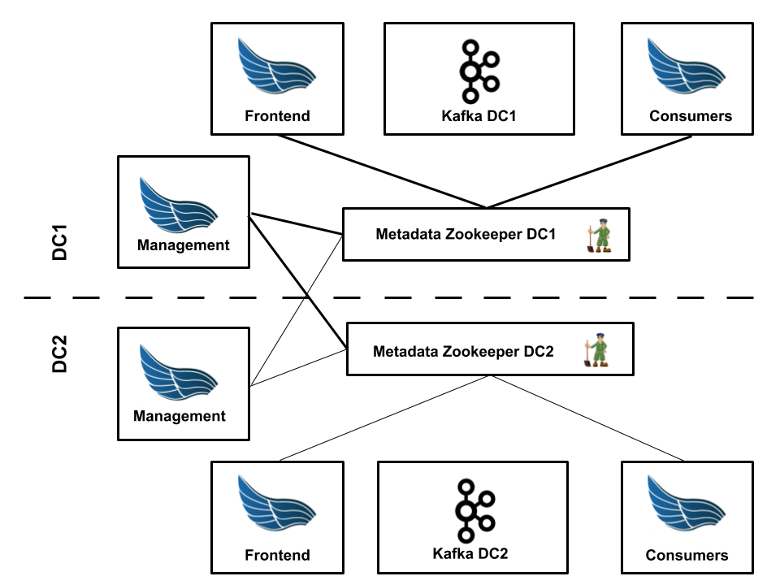

# Kafka and Zookeeper

## Preferring local clusters in Frontend and Consumers

To ensure the lowest possible response times, it is recommended to connect to local zookeeper and kafka clusters.
In the configuration, you can specify the properties of multiple clusters. For example:

```yaml
consumer:
  datacenter:
    name:
      source: "ENV"
      env: "DC"
  zookeeper:
    clusters:
      - datacenter: "dc-1"
        connectionString: "zk-1:2181"
      - datacenter: "dc-2"
        connectionString: "zk-2:2181"
  kafka:
    clusters:
      - datacenter: "dc-1"
        brokerList: "kafka-1:9092"
      - datacenter: "dc-2"
        brokerList: "kafka-2:9092"
```

If you don't specify the `{modulePrefix}.datacenter.name.source` property hermes will look for a cluster in properties with the `datacenter: "dc"` property.
Hermes also supports retrieving information about the name of the datacenter based on an environment variable. All you have to do is specify
`{modulePrefix}.datacenter.name.source` to `ENV` just like above, and the name of variable `{modulePrefix}.datacenter.name.env` in which the datacenter name is stored.

## Zookeeper

Hermes uses Zookeeper as metadata store. It does not have to be the same Zookeeper as the one used by Kafka.

Option in Frontend/Consumers                                 | Option in Management           | Description                                                                | Default value
------------------------------------------------------------ | ------------------------------ | -------------------------------------------------------------------------- | --------------
{modulePrefix}.zookeeper.clusters.[n].connectionString       | storage.connectionString       | Zookeeper connection string                                                | localhost:2181
{modulePrefix}.zookeeper.clusters.[n].connectionTimeout      | storage.connectTimeout         | connection timeout in seconds                                              | 10s
{modulePrefix}.zookeeper.clusters.[n].maxRetries             | storage.retryTimes             | retry count when connection fails                                          | 2
{modulePrefix}.zookeeper.clusters.[n].baseSleepTime          | storage.retrySleep             | time to wait between subsequent retries in seconds                         | 1s
{modulePrefix}.zookeeper.clusters.[n].root                   | storage.pathPrefix             | prefix for Hermes data (if not specified in connection string)             | /hermes
{modulePrefix}.zookeeper.clusters.[n].authorization.enabled  | n/a                            | enable Zookeeper authorization                                             | false
{modulePrefix}.zookeeper.clusters.[n].authorization.scheme   | storage.authorization.scheme   | authorization scheme                                                       | digest
{modulePrefix}.zookeeper.clusters.[n].authorization.user     | storage.authorization.user     | username                                                                   | user
{modulePrefix}.zookeeper.clusters.[n].authorization.password | storage.authorization.password | password                                                                   | password

## Kafka

### Single Kafka cluster

In simple case, Hermes is connected to just one Kafka cluster. Frontend and Consumers connect to Kafka to publish
and pull messages. Management connects to Kafka to manage existing topics and initiate retransmissions.

Frontend and Consumers options:

Option                         | Description                                                                              | Default value
------------------------------ | ---------------------------------------------------------------------------------------- | --------------
kafka.broker.list              | list of all brokers in the cluster (or at least some contact points); separated with ',' | localhost:9092
kafka.namespace                | namespace is a prefix prepended to all Kafka topics and consumer groups used by Hermes   | <empty>
kafka.zookeeper.connect.string | [Consumers only] connection string to Kafka Zookeeper                                    | localhost:2181
kafka.cluster.name             | name of Kafka cluster (relevant only when connecting to multiple clusters)               | primary

Zookeeper connection specific options (retries etc) are read from Metadata Zookeeper options.

Management module can connect to multiple Kafka clusters at once (see [section below](#multiple-kafka-and-zookeeper-clusters)), thus
when specifying connection option is done per cluster. Simple configuration for single cluster looks following:

```yaml
kafka:
  defaultNamespace: // namespace shared by all clusters, default: <empty>
  clusters:
    -
      clusterName: // name of cluster, can be any arbitrary string, default: primary
      connectionString: // connection string to cluster Zookeeper, default: localhost:2181
```

### Multiple Kafka and Zookeeper clusters

Hermes can be configured to publish and read messages to/from multiple Kafka clusters and to store metadata in multiple Zookeeper clusters.
We use this feature on production environment where we have separated kafka clusters in different data centers. If Kafka in one DC fails, whole traffic
can be routed to the second DC. This scenario assumes, that Kafka clusters hold different set of messages. There is no
support for multiple clusters each holding the same copy of data.

This is the schematics of two data center architecture:



* there are specific **Frontend** and **Consumers** instances per cluster:
    * each **Frontend** instance writes data to single cluster
    * each **Consumers** instance reads data from single cluster
* each **Management** instance:
    * connects to all Kafka clusters and keeps topics and subscriptions in-sync
    * connects to all Zookeeper clusters and keeps metadata in-sync

Configuring Frontend and Consumers is easy: use configuration options from [previous chapter](#single-kafka-cluster) to
connect to given clusters. Remember about specifying proper `kafka.cluster.name`.

Since Management instances need to know all clusters, their configuration is bit more complex. Example configuration for
the schematics provided above:

```yaml
kafka:
  clusters:
    -
      datacenter: dc1
      clusterName: kafka_primary
      connectionString: kafka-zookeeper:2181/clusters/dc1
    -
      datacenter: dc2
      clusterName: kafka_secondary
      connectionString: kafka-zookeeper:2181/clusters/dc2

storage:
  pathPrefix: /run/hermes
  clusters:
    -
      datacenter: dc1
      clusterName: zk1
      connectionString: metadata-zookeeper.dc1:2181
    -
      datacenter: dc2
      clusterName: zk2
      connectionString: metadata-zookeeper.dc2:2181
```

### Multiple Hermes on single Kafka cluster

It’s also possible to run multiple Hermes clusters on a single Kafka cluster, e.g. to separate different test environments.
To do this, on each Hermes cluster you have to provide different value for:
* `kafka.namespace` property in **Frontend** and **Consumers**. In **Management** it’s named `kafka.defaultNamespace` and also need to be changed.
* `zookeeper.root` property in **Frontend** and **Consumers** if you use the same Zookeeper cluster for all Hermes clusters.
In **Management** it’s named `storage.pathPrefix` and also need to be changed.

`kafka.namespace` property also can used to distinguish Hermes-managed topics on multi-purpose Kafka cluster.

